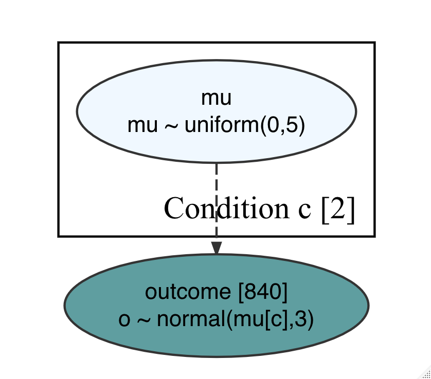

```{r setup, include=FALSE}
knitr::opts_chunk$set(echo = TRUE)
```

The purpose of this project is to illustrate how to use the [causact](https://www.causact.com/) library to build some simple models. Causact allows you to create Bayesian models, and uses the [greta](https://greta-stats.org/index.html) library to do the computations. Well, not really - greta just sets them up, and uses TensorFlow underneath.

The cool thing is with causact you can describe your model as a graph, like this:


and it automatically generates the greta code which you can run to get estimates of everything.

[First post here!](https://github.com/prabinov42/Greta_Causact_Exploration/blob/main/greta_causact_exploration.md)

More stuff to come soon.