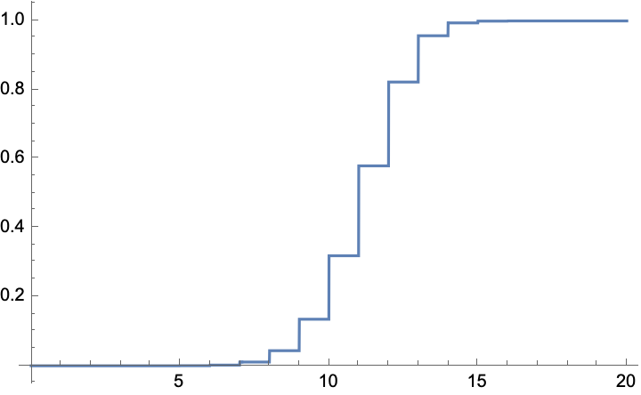

```{r setup, include=FALSE}
knitr::opts_chunk$set(echo = TRUE)
```

# Introduction

Python, R and SQL are the most commonly used tools by data scientists.
But there is another tool that can be incredibly useful on occasion: [Mathematica](https://www.wolfram.com/mathematica/).

Mathematica has since added all sorts of [data science features](https://www.wolfram.com/featureset/data-science/?source=nav), but what I show here is just some of the cool thing you can do with probabilistic modeling.

The following is a minor update of a blog I did many years ago - I'm moving it here from Wordpress, and taking the opportunity to add a bit more info.

It was originally about trying to calculate the probability of a complicated system failing, involving many components each with their own probabilities, parameters, etc.
At the time (it was a real project at work, here sufficiently generalized so as to anonymize it) I did not really believe that Mathematica could help.
I planned to simulate it, but figured I'd give it a shot for fun.

Here we go....

# Probability Modeling with Mathematica

At some point, I will write a post about the utility of modeling in data science: how the act of creating a realistic model of the process that generates the data can alert you to wonky data, to which features of your data really matter for the problem at hand, and how the model can be used in Bayesian analysis.

But in this post, I want only to demonstrate how easy it is to create models in Mathematica that would be ridiculously difficult, time consuming, and error prone to do by hand.

This model is an abstraction of a real problem I worked on, and the names and parameters have been changed to protect the innocent.

Notation conventions in this example:

-   any variable that ends with a *D* is a distribution.
    Not a sample from a distribution, or a mean of the distribution, but the distribution itself.

-   any variable that ends in an *X* is a random variable

-   the symbol *≈* indicates *distributed as*.
    So, *fX≈fD* means that the random variable *fX* has distribution *fD*.
    If you are trying to reproduce this yourself, sometimes copying this symbol from the web gets wonky - enter it by hitting the escape key, then typing *dist*, then hitting the escape key again

-   anything that ends in an *R* is a result calculated earlier

If you are going to do this kind of modeling, it helps to have such conventions so that it is obvious to you what is a distribution, what is a random variable, what is a number, etc.

To the code/model!

    aD = ExponentialDistribution[1/10]

This line defines *aD* to be an exponential distribution with parameter *1/10*.
No surprise there!

    bD = ParameterMixtureDistribution[PoissonDistribution[aX/3], aX ≈ aD];

This line defines *bD* to be a Poisson distribution, where the parameter of the distribution is another random variable, *aX/3*, where *aX* has distribution *aD* (exponential, as defined above).
So, we are building a hierarchical model here.

    cR = Probability[bX >= 1, bX ≈ bD];

Here we calculate the probability that a *bD* distributed random variable is greater than or equal to *1*.

    dD = BinomialDistribution[99, cR];

And this line defines *dD* to be a binomial distribution with parameters *99* and *cR*, which we calculated above.

    eD = TransformedDistribution[100*Binomial[dX, 2]/Binomial[100, 2], dX ≈ dD];

*eD* is the distribution of a more complicated random variable: *dX* is distributed according to *dD*, then we apply a somewhat complicated function to it.
*eD* is its distribution.

    fD = TransformedDistribution[ eX*aX, {eX ≈ eD, aX ≈ aD}];

Here *fD* is the distribution of the product of two (assumed independent) random variables, *eX* and *aX*, distributed according to *eD* and *aD* respectively.

    gD = TransformedDistribution[2^10/(1 + dX), dX ≈ dD];

This line defines *gD* to be the distribution of a constant divided by *1+dX*, where *dX* is a *dD* distributed random variable.

    hR = Probability[fX > 100, fX ≈ fD];

*hR* is the probability that an *fD* distributed random variable is greater than a large constant.

    iD = ParameterMixtureDistribution[BinomialDistribution[Round[gX], hR], gX ≈ gD];

This line defines *iD* to be a binomial distribution, with the second parameter being *hR* as calculated above.
To get the first parameter, we have a *gD* distributed random variable, and then we round it to the nearest integer.

Now that we have our final distribution, we can treat it pretty much as any build in distribution.
I say pretty much because, for example, Mathematica does not know how to determine its quantiles, etc.

But we can do this:

    Mean[iD]

and if I do I will get about 12,500 characters of output, the exact value.
But if I do

    Mean[iD]//N

I get 11.2276.

Or I can do this:

    Plot[CDF[iD, x], {x, 0, 50}]

{width="433"}

or many other things.

This is very cool for a dozen lines of code.

If you want some real tedious pain, try to do this by hand, and let me know if you succeed!

# What functions do these functions do?

Most of them are obvious from the name of the function (and there are many more - including calculating conditional probabilities and expectations!), but I was initially confused about what these two do:

-   *ParameterMixtureDistribution* calculates the distribution of a random variables where one or more of the parameters of the distributions are from other distributions.

-   *TransformedDistribution* calculates the distribution of random variables that are functions of other random variables.

# Last words

To me, it is astounding that Mathematica can calculate this...*calculate*, not estimate or simulate, but do all the manipulations that you would do on paper if you had the time and never made an error.

You can do some of these kind of manipulations on [WolframAlpha](https://www.wolframalpha.com/) for free, but perhaps not all, and your computation time will be limited.
Alternatively, you can download the [WolframEngine](https://www.wolfram.com/engine/?source=nav) and make it work with Jupyter (I did that several years ago - don't remember how, but it wasn't a big deal).

# Bonus Material

The Mathematics symbol for conditional probability is, well, a weird thing you enter by hitting the escape key, then *cond*, then the escape key again.
Alternatively, you can use the full input form, as we do here because the symbol did not come across cleanly.

## Example 1

    aD = ExponentialDistribution[m];
    Probability[Conditioned[x > a + b, x > a], Distributed[x, aD], Assumptions -> a > 0 && b > 0]

which yields

    E^((-b)*m)

and

    Probability[x > b, Distributed[x, aD], Assumptions -> b > 0]

which also yields

    E^((-b)*m)

which is a well known property of the exponential distribution.

## Example 2

Another example:

    TransformedDistribution[ x + y, {Distributed[x, PoissonDistribution[m1]], Distributed[y, PoissonDistribution[m2]]}]

yields

    PoissonDistribution[m1 + m2]

also

    n=13;
    TransformedDistribution[Total[Array[x, n]], Array[Distributed[x[#], PoissonDistribution[a]] &, n]]

yields

    PoissonDistribution[13*a]

## Example 3

One final example (thanks to <https://mathematica.stackexchange.com/>)

    n = 13; 
    TransformedDistribution[Min[Array[x, n]], Table[Distributed[x[i], ExponentialDistribution[m]], {i, n}]]

gives

    ExponentialDistribution[13*m]

# Appendices

<details>

<summary>Info</summary>

I'm using Mathematica Home Edition, v13.1 on a Mac OS 12.6.

</details>
