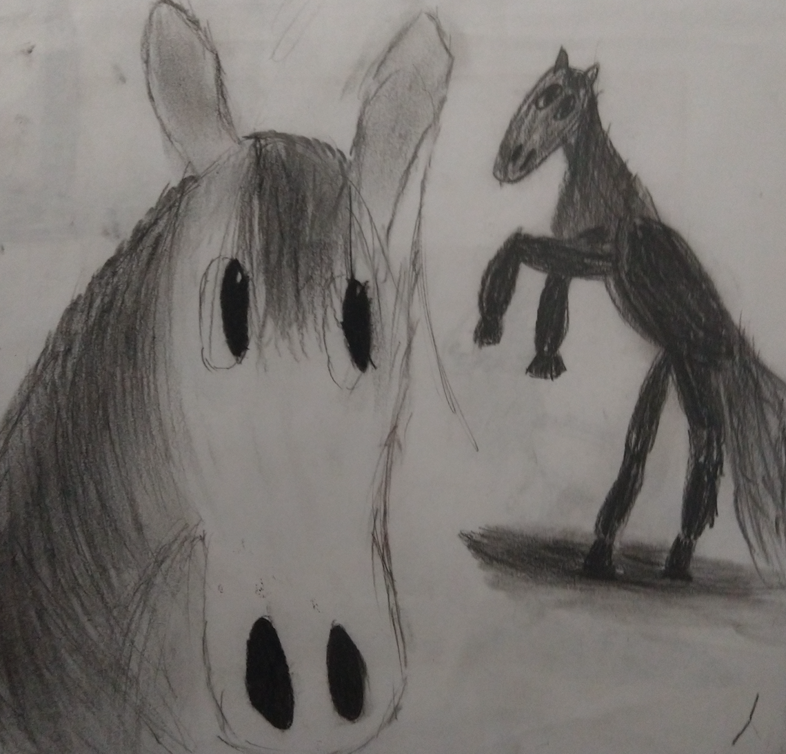

```{r setup, include=FALSE}
knitr::opts_chunk$set(echo = TRUE)
```


A million years ago I used horse racing as a demonstration domain for my students who were learning to use R to do data science. It was a convenient topic because it requires very little prior knowledge. I then (during the lock-downs) wrote a series of posts about this project. I have since cleaned it up a bit and migrated it from Wordpress to [here](https://github.com/prabinov42/ponies_blog/blob/main/ponies_blog.md).

Be forewarned - the way to make money at the track is to own the track - not to bet on the horses!


